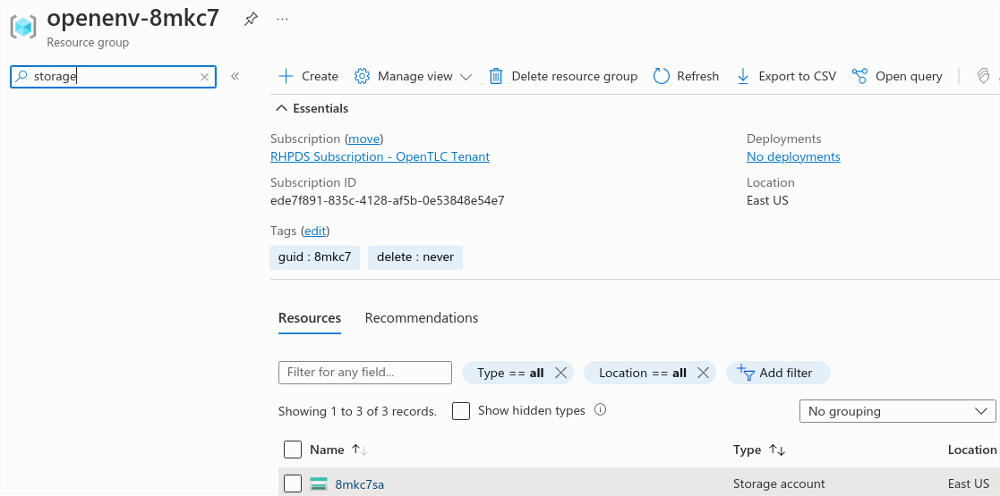
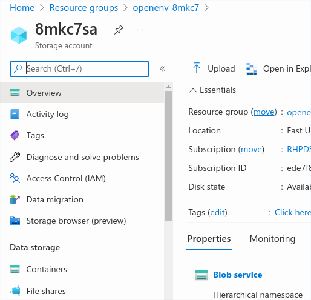
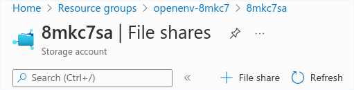
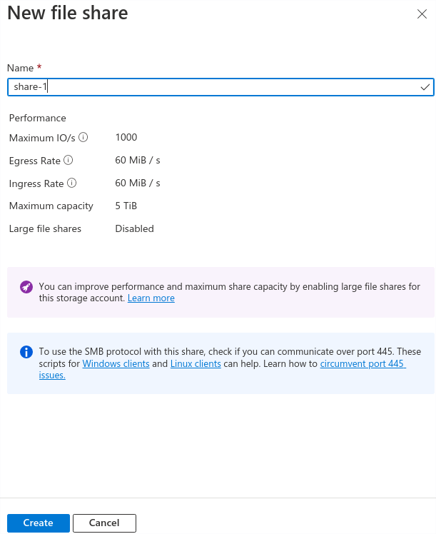
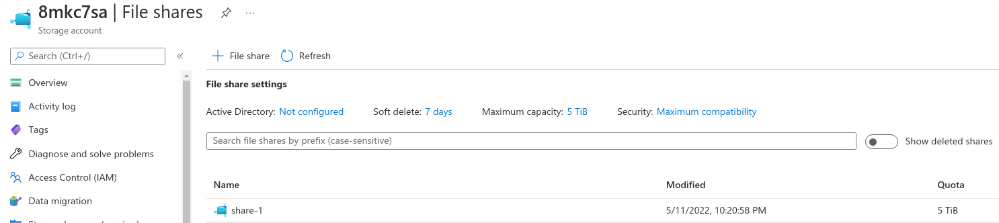
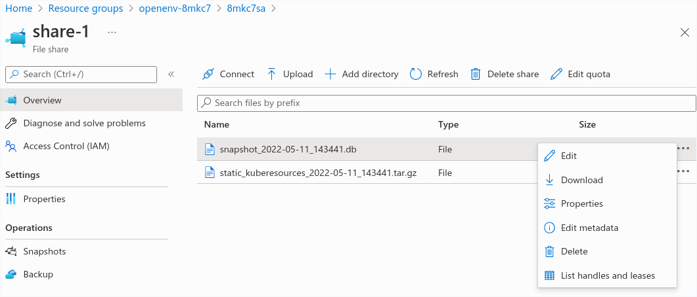

# etcd-backup-azure

**Reference**
https://gitlab.consulting.redhat.com/customer-success/consulting-engagement-reports/client-cers/asean/cambodia/woori-bank/wb-ocp-4646938/wb-ocp4.9-nonprod#user-content-etcd-backup

**Git**
```
echo "# eycd-backup-azure" >> README.md
git init
git add README.md
git commit -m "first commit"
git branch -M main
git remote add origin https://github.com/alpha-wolf-jin/eycd-backup-azure.git
git config --global credential.helper 'cache --timeout 7200'
git push -u origin main

git add . ; git commit -a -m "update README" ; git push -u origin main
```

# ETCD Backup

### Create new namespace for etcd backup

```
# oc new-project etcd-backup

```

### Create service account

```
# oc create sa etcd-backup-user

# oc adm policy add-scc-to-user privileged system:serviceaccount:etcd-backup:etcd-backup-user

# oc adm policy add-scc-to-user anyuid system:serviceaccount:etcd-backup:etcd-backup-user

```

### Create service account
```
# export RESOURCE_GROUP=openenv-8mkc7
# export AZURE_REGION=eastus
# export CLIENT_ID=9bdcd01e
# export PASSWORD=cKeXWwB
# export TENANT=1ce7852f
# export SUBSCRIPTION=ede7f
# export RESOURCEGROUP=openenv-8mkc7
# az login --service-principal -u $CLIENT_ID -p $PASSWORD --tenant $TENANT

# Name '8mkc7sa' has to be uniq globally. Here I used GUID

# az storage account create -g openenv-8mkc7 --location eastus --name 8mkc7sa --kind Storage --sku Standard_LRS
# export ACCOUNT_KEY=`az storage account keys list -g openenv-8mkc7 --account-name 8mkc7sa --query "[0].value" -o tsv`
# echo $ACCOUNT_KEY
ufFEq7exDzRFyDSgUAgMASm+AStcDT+UQ==

```
### Create a Secret object that contains the Azure File credentials
```
# oc create secret generic storage-file --from-literal=azurestorageaccountname=8mkc7sa --from-literal=azurestorageaccountkey=$ACCOUNT_KEY

```

### Create a PersistentVolume object that references the Secret object you created

https://docs.openshift.com/container-platform/4.9/storage/persistent_storage/persistent-storage-azure-file.html

```
# vi pv-01.yaml
apiVersion: "v1"
kind: "PersistentVolume"
metadata:
  name: "pv0001"
spec:
  capacity:
    storage: "20Gi" 
  accessModes:
    - "ReadWriteMany"
  storageClassName: azure-file-sc
  azureFile:
    secretName: storage-file
    shareName: share-1 
    readOnly: false

# vi pvc-01.yaml
apiVersion: "v1"
kind: "PersistentVolumeClaim"
metadata:
  name: "claim1"
spec:
  accessModes:
    - "ReadWriteMany"
  resources:
    requests:
      storage: "20Gi" 
  storageClassName: azure-file-sc
  volumeName: "pv0001"

# oc apply -f pv-01.yaml 

# oc get pv
NAME     CAPACITY   ACCESS MODES   RECLAIM POLICY   STATUS      CLAIM   STORAGECLASS    REASON   AGE
pv0001   20Gi       RWX            Retain           Available           azure-file-sc            5s

# oc apply -f pvc-01.yaml 

# oc get pvc
NAME     STATUS    VOLUME   CAPACITY   ACCESS MODES   STORAGECLASS    AGE
claim1   Pending   pv0001   0                         azure-file-sc   4s

```

### Create configmap to contain cluster backup script

```
# vim etcd-backup-cm.yaml
kind: ConfigMap
apiVersion: v1
metadata:
  name: etcd-backup-script
  namespace: etcd-backup
data:
  etcd-backup.sh: |
    #!/usr/bin/env bash

    ### Created by cluster-etcd-operator. DO NOT edit.

    set -o errexit
    set -o pipefail
    set -o errtrace

    # example
    # cluster-backup.sh $path-to-snapshot

    if [[ $EUID -ne 0 ]]; then
      echo "This script must be run as root"
      exit 1
    fi

    function usage {
      echo 'Path to backup dir required: ./cluster-backup.sh <path-to-backup-dir>'
      exit 1
    }

    # If the first argument is missing, or it is an existing file, then print usage and exit
    if [ -z "$1" ] || [ -f "$1" ]; then
      usage
    fi

    if [ ! -d "$1" ]; then
      mkdir -p "$1"
    fi

    # backup latest static pod resources
    function backup_latest_kube_static_resources {
      RESOURCES=("$@")

      LATEST_RESOURCE_DIRS=()
      for RESOURCE in "${RESOURCES[@]}"; do
        # shellcheck disable=SC2012
        LATEST_RESOURCE=$(ls -trd "${CONFIG_FILE_DIR}"/static-pod-resources/"${RESOURCE}"-[0-9]* | tail -1) || true
        if [ -z "$LATEST_RESOURCE" ]; then
          echo "error finding static-pod-resource ${RESOURCE}"
          exit 1
        fi

        echo "found latest ${RESOURCE}: ${LATEST_RESOURCE}"
        LATEST_RESOURCE_DIRS+=("${LATEST_RESOURCE#${CONFIG_FILE_DIR}/}")
      done

      # tar latest resources with the path relative to CONFIG_FILE_DIR
      tar -cpzf "$BACKUP_TAR_FILE" -C "${CONFIG_FILE_DIR}" "${LATEST_RESOURCE_DIRS[@]}"
      chmod 600 "$BACKUP_TAR_FILE"
    }

    function source_required_dependency {
      local path="$1"
      if [ ! -f "${path}" ]; then
        echo "required dependencies not found, please ensure this script is run on a node with a functional etcd static pod"
        exit 1
      fi
      # shellcheck disable=SC1090
      source "${path}"
    }

    BACKUP_DIR="$1"
    DATESTRING=$(date "+%F_%H%M%S")
    BACKUP_TAR_FILE=${BACKUP_DIR}/static_kuberesources_${DATESTRING}.tar.gz
    SNAPSHOT_FILE="${BACKUP_DIR}/snapshot_${DATESTRING}.db"
    BACKUP_RESOURCE_LIST=("kube-apiserver-pod" "kube-controller-manager-pod" "kube-scheduler-pod" "etcd-pod")

    trap 'rm -f ${BACKUP_TAR_FILE} ${SNAPSHOT_FILE}' ERR

    source_required_dependency /etc/kubernetes/static-pod-resources/etcd-certs/configmaps/etcd-scripts/etcd.env
    source_required_dependency /etc/kubernetes/static-pod-resources/etcd-certs/configmaps/etcd-scripts/etcd-common-tools

    # TODO handle properly
    if [ ! -f "$ETCDCTL_CACERT" ] && [ ! -d "${CONFIG_FILE_DIR}/static-pod-certs" ]; then
      ln -s "${CONFIG_FILE_DIR}"/static-pod-resources/etcd-certs "${CONFIG_FILE_DIR}"/static-pod-certs
    fi

    IP_ADDR=$(hostname -i)

    #dl_etcdctl
    backup_latest_kube_static_resources "${BACKUP_RESOURCE_LIST[@]}"
    ETCDCTL_ENDPOINTS="https://${IP_ADDR}:2379" etcdctl snapshot save "${SNAPSHOT_FILE}"
    echo "snapshot db and kube resources are successfully saved to ${BACKUP_DIR}"

# oc apply -f etcd-backup-cm.yaml

# oc get cm
NAME                       DATA   AGE
etcd-backup-script         1      6s
kube-root-ca.crt           1      3h33m
openshift-service-ca.crt   1      3h33m

```

### SHA ID

Access master node and get sha ID

```
sh-4.4# pwd
/etc/kubernetes/manifests

sh-4.4# cat etcd-pod.yaml | jq . | grep -B1 -i '"image":'
        "name": "setup",
        "image": "quay.io/openshift-release-dev/ocp-v4.0-art-dev@sha256:f04f01e3eb71cee82ce55fb0dd550439e73a9fbe57527e39c9139647e6335b63",
--
        "name": "etcd-ensure-env-vars",
        "image": "quay.io/openshift-release-dev/ocp-v4.0-art-dev@sha256:f04f01e3eb71cee82ce55fb0dd550439e73a9fbe57527e39c9139647e6335b63",
--
        "name": "etcd-resources-copy",
        "image": "quay.io/openshift-release-dev/ocp-v4.0-art-dev@sha256:f04f01e3eb71cee82ce55fb0dd550439e73a9fbe57527e39c9139647e6335b63",
--
        "name": "etcdctl",
        "image": "quay.io/openshift-release-dev/ocp-v4.0-art-dev@sha256:f04f01e3eb71cee82ce55fb0dd550439e73a9fbe57527e39c9139647e6335b63",
--
        "name": "etcd",
        "image": "quay.io/openshift-release-dev/ocp-v4.0-art-dev@sha256:f04f01e3eb71cee82ce55fb0dd550439e73a9fbe57527e39c9139647e6335b63",
--
        "name": "etcd-metrics",
        "image": "quay.io/openshift-release-dev/ocp-v4.0-art-dev@sha256:f04f01e3eb71cee82ce55fb0dd550439e73a9fbe57527e39c9139647e6335b63",
--
        "name": "etcd-health-monitor",
        "image": "quay.io/openshift-release-dev/ocp-v4.0-art-dev@sha256:d2b6a8659e618224aba92fd8948fa92f564a1991e45d1d947d2a7b722a10bd69",


```

### Create ETCD backup cronjob

```
# vim etcd-backup-cron.yaml
kind: CronJob
apiVersion: batch/v1beta1
metadata:
  name: cronjob-etcd-backup
  namespace: etcd-backup
  labels:
    purpose: etcd-backup
spec:
  schedule: "10 10 * * *"
  startingDeadlineSeconds: 200
  concurrencyPolicy: Forbid
  suspend: false
  jobTemplate:
    spec:
      backoffLimit: 0
      template:
        spec:
          nodeSelector:
            node-role.kubernetes.io/master: ''
          restartPolicy: Never
          activeDeadlineSeconds: 200
          serviceAccountName: etcd-backup-user
          hostNetwork: true
          containers:
            - resources:
                requests:
                  cpu: 300m
                  memory: 250Mi
              terminationMessagePath: /dev/termination-log
              name: etcd-backup
              command:
                - /bin/sh
                - '-c'
                - >-
                  /usr/local/bin/etcd-backup.sh /mnt/backup
              securityContext:
                privileged: true
              imagePullPolicy: IfNotPresent
              volumeMounts:
                - name: certs
                  mountPath: /etc/ssl/etcd/
                - name: conf
                  mountPath: /etc/etcd/
                - name: kubeconfig
                  mountPath: /etc/kubernetes/
                - name: etcd-backup-script
                  mountPath: /usr/local/bin/etcd-backup.sh
                  subPath: etcd-backup.sh
                - name: etcd-backup
                  mountPath: /mnt/backup
                - name: scripts
                  mountPath: /usr/local/bin
              terminationMessagePolicy: FallbackToLogsOnError
              image: >-
                quay.io/openshift-release-dev/ocp-v4.0-art-dev@sha256:f04f01e3eb71cee82ce55fb0dd550439e73a9fbe57527e39c9139647e6335b63
          serviceAccount: etcd-backup-user
          tolerations:
            - operator: Exists
              effect: NoSchedule
            - operator: Exists
              effect: NoExecute
          volumes:
            - name: certs
              hostPath:
                path: /etc/kubernetes/static-pod-resources/etcd-member
                type: ''
            - name: conf
              hostPath:
                path: /etc/etcd
                type: ''
            - name: kubeconfig
              hostPath:
                path: /etc/kubernetes
                type: ''
            - name: scripts
              hostPath:
                path: /usr/local/bin
                type: ''
            - name: etcd-backup
              persistentVolumeClaim:
                claimName: claim1
            - name: etcd-backup-script
              configMap:
                name: etcd-backup-script
                defaultMode: 493

# oc apply -f etcd-backup-cron.yaml

```

### Testing backup job

```
# oc create job --from=cronjob/cronjob-etcd-backup test-backup-001
job.batch/test-backup-001 created

# oc get pod
NAME                       READY   STATUS              RESTARTS   AGE
test-backup-001--1-wr75d   0/1     ContainerCreating   0          3m20s

# oc logs -f test-backup-001--1-wr75d

# oc describe pod test-backup-001--1-wr75d
...
Events:
  Type     Reason       Age                  From               Message
  ----     ------       ----                 ----               -------
  Normal   Scheduled    4m2s                 default-scheduler  Successfully assigned etcd-backup/test-backup-001--1-wr75d to aro-cluster-8mkc7-gg7vx-master-2
  Warning  FailedMount  119s                 kubelet            Unable to attach or mount volumes: unmounted volumes=[etcd-backup], unattached volumes=[kube-api-access-68xws certs conf kubeconfig etcd-backup-script etcd-backup scripts]: timed out waiting for the condition
  Warning  FailedMount  113s (x9 over 4m2s)  kubelet            MountVolume.SetUp failed for volume "pv0001" : mount failed: exit status 32
Mounting command: mount
Mounting arguments: -t cifs -o file_mode=0777,dir_mode=0777,vers=3.0,actimeo=30,mfsymlinks,<masked> //8mkc7sa.file.core.windows.net/share-1 /var/lib/kubelet/pods/f20f3d97-e7ac-4e49-982e-4d5189b9baab/volumes/kubernetes.io~azure-file/pv0001
Output: mount error(2): No such file or directory
Refer to the mount.cifs(8) manual page (e.g. man mount.cifs) and kernel log messages (dmesg)

# oc get pv,pvc
NAME                      CAPACITY   ACCESS MODES   RECLAIM POLICY   STATUS   CLAIM                STORAGECLASS    REASON   AGE
persistentvolume/pv0001   20Gi       RWX            Retain           Bound    etcd-backup/claim1   azure-file-sc            46m

NAME                           STATUS   VOLUME   CAPACITY   ACCESS MODES   STORAGECLASS    AGE
persistentvolumeclaim/claim1   Bound    pv0001   20Gi       RWX            azure-file-sc   45m

```

### Login azure portal and creat share

**Select the resource group and click related storage account**




**Click `File shares` at the most left windows**




**click `+ File shares`**




**Put in shareName used in PV creation**




**New files share created**



>the file share should be created before PV creation. And the same shareName should be used during PV creation


### Re-Testing backup job

```
# oc get job
NAME              COMPLETIONS   DURATION   AGE
test-backup-001   0/1           70m        70m

# oc delete job test-backup-001

# oc create job --from=cronjob/cronjob-etcd-backup test-backup-001

# oc get pod -o wide
NAME                       READY   STATUS      RESTARTS   AGE     IP         NODE                               NOMINATED NODE   READINESS GATES
test-backup-001--1-9nhps   0/1     Completed   0          4m12s   10.0.0.9   aro-cluster-8mkc7-gg7vx-master-1   <none>           <none>

```

### Download backup file from azure portal if needed



>A backup directory containing both the etcd snapshot and the resources for the static pods, which were from the same backup. The file names in the directory must be in the following formats: snapshot_<datetimestamp>.db and static_kuberesources_<datetimestamp>.tar.gz

# ETCD Restore Step

https://docs.openshift.com/container-platform/4.9/backup_and_restore/control_plane_backup_and_restore/disaster_recovery/scenario-2-restoring-cluster-state.html
